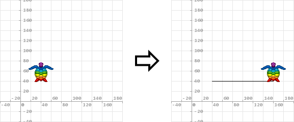
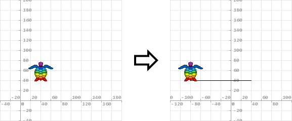
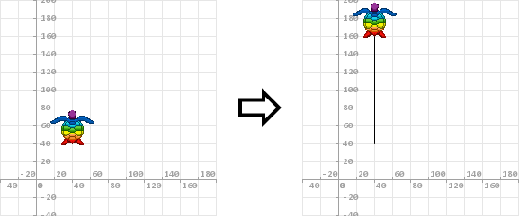
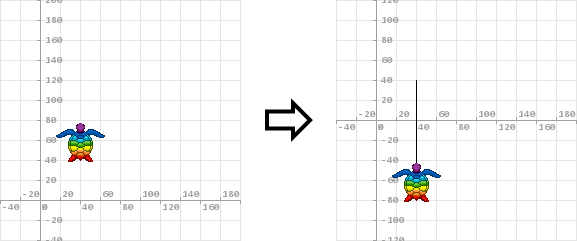
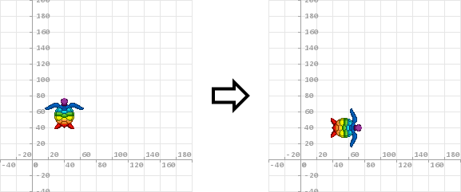
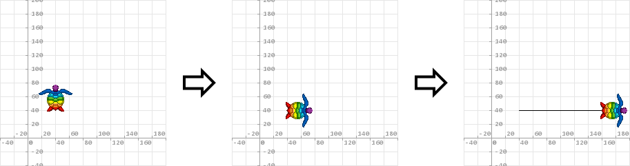
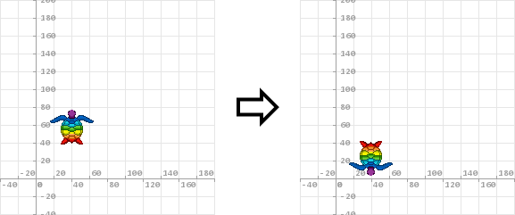
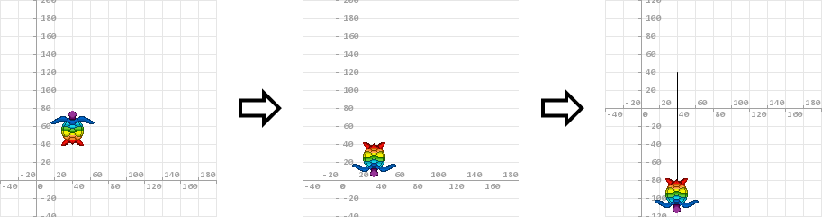

# Movimentação da Tartaruga

A Tartaruga pode se movimentar para direita, para esquerda, para cima e para baixo, além de poder ir para uma coordenada qualquer e poder girar em uma quantidade qualquer de graus ou radianos. Inicialmente a Tartaruga está parada na coordenada ```(0; 0)```, mas para os exemplos abaixo, com o objetivo de permitir que você possa ver a movimentação da Tartaruga e o rastro/desenho que ela faz ao ser movimentada, ela partirá do ponto ```(40; 40)```. A coordenada da posição da Tartaruga corresponde à ponta de seu rabo.

[Voltar à Página Principal](../README.md)

- **Movimentação da Tartaruga**
  - [Andar para Direita](#andar-para-direita)
  - [Andar para Esquerda](#andar-para-esquerda)
  - [Andar para Cima](#andar-para-cima)
  - [Andar para Baixo](#andar-para-baixo)
  - [Girar](#girar)
    - [Rotação em Graus](#rotação-em-graus)
    - [Rotação em Radianos](#rotação-em-radianos)


## Andar para Direita

```AuroraLogo
vá para direita em quantidade .
```

A Tartaruga anda para direita em uma ```quantidade``` de pixels com base na posição atual.

**Parâmetro(s):**

 > - **quantidade:** quantidade de pixels que a Tartaruga se movimentará para direita com base na posição atual.

**Exemplo:**
 > ```vá para direita em 120 .```
 >
 > 

[Voltar](#movimentação-da-tartaruga)


## Andar para Esquerda

```AuroraLogo
vá para esquerda em quantidade .
```

A Tartaruga anda para esquerda em uma ```quantidade``` de pixels com base na posição atual.

**Parâmetro(s):**

 > - **quantidade:** quantidade de pixels que a Tartaruga se movimentará para esquerda com base na posição atual.

**Exemplo:**
 > ```vá para esquerda em 120 .```
 >
 > 

[Voltar](#movimentação-da-tartaruga)


## Andar para Cima

```AuroraLogo
vá para cima em quantidade .
```

A Tartaruga anda para cima em uma ```quantidade``` de pixels com base na posição atual.

**Parâmetro(s):**
 > - **quantidade:** quantidade de pixels que a Tartaruga se movimentará para cima com base na posição atual.

**Exemplo:**
 > ```vá para cima em 120 .```
 >
 > 

[Voltar](#movimentação-da-tartaruga)


## Andar para Baixo

```AuroraLogo
vá para baixo em quantidade .
```

A Tartaruga anda para baixo em uma ```quantidade``` de pixels com base na posição atual.

**Parâmetro(s):**

 > - **quantidade:** quantidade de pixels que a Tartaruga se movimentará para baixo com base na posição atual.

**Exemplo:**
 > ```vá para baixo em 120 .```
 >
 > 

[Voltar](#movimentação-da-tartaruga)

 
## Girar

```AuroraLogo
girar em quantidade unidade .
```

A Tartaruga gira/rotaciona em uma ```quantidade``` de graus ou radianos, especificada por ```unidade```. O pivô da rotação é a ponta do rabo da Tartaruga, ou seja, sua coordenada atual.

[Voltar](#movimentação-da-tartaruga)


### Rotação em Graus

```AuroraLogo
girar em quantidade graus .
```

A Tartaruga gira/rotaciona em uma ```quantidade``` de graus com base no ângulo de rotação atual.

**Parâmetro(s):**

 > - **quantidade:** quantidade de graus que a Tartaruga se girará com base no ângulo de rotação atual.

**Exemplos:**
 > ```girar em 90 graus .```
 >
 > 
 >
 > ```AuroraLogo
 > girar em 90 graus .
 > vá para cima em 120 .
 > ```
 >
 > 

[Voltar](#movimentação-da-tartaruga)


### Rotação em Radianos

```AuroraLogo
girar em quantidade radianos .
``` 

A Tartaruga gira/rotaciona em uma ```quantidade``` de radianos com base no ângulo de rotação atual.

**Parâmetro(s):**

 > - **quantidade:** quantidade de radianos que a Tartaruga se girará com base no ângulo de rotação atual.

**Exemplos:**
 > ```girar em PI radianos .```
 >
 > 
 >
 > ```AuroraLogo
 > girar em PI radianos .
 > vá para cima em 120 .
 > ```
 >
 > 

[Voltar](#movimentação-da-tartaruga)
