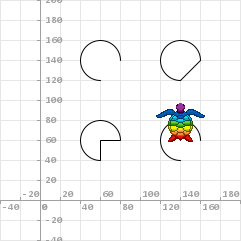

# Instruções de Desenho

Abaixo são descritas todas as operações de desenho suportadas na linguagem de programação AuroraLogo. Essas instruções são sempre precedidas pela palavra chave ```desenhar```.

[Voltar à Página Principal](../README.md)

- **Instruções de Desenho**
  - [Desenhar Segmento](#desenhar-segmento)
  - [Desenhar Quadrado](#desenhar-quadrado)
  - [Desenhar Retângulo](#desenhar-retângulo)
  - [Desenhar Retângulo de Cantos Arredondados](#desenhar-retângulo-de-cantos-arredondados)
  - [Desenhar Círculo](#desenhar-círculo)
  - [Desenhar Elipse](#desenhar-elipse)
  - [Desenhar Arco](#desenhar-arco)
  - [Desenhar Polígono Regular](#desenhar-polígono-regular)
  - [Desenhar Estrela](#desenhar-estrela)
  - [Desenhar Polígono](#desenhar-polígono)
  - [Desenhar Curva Bézier Quadrática](#desenhar-curva-bézier-quadrática)
  - [Desenhar Curva Bézier Cúbica](#desenhar-curva-bézier-cúbica)
  - [Desenhar Caminho](#desenhar-caminho)
    - [Mover Até](#mover-até)
    - [Linha Até](#linha-até)
    - [Curva Quadrática Até](#curva-quadrática-até)
    - [Curva Cúbica Até](#curva-cúbica-até)
    - [Fechar](#fechar)


## Desenhar Segmento

```AuroraLogo
desenhar segmento( x1,  y1,  x2,  y2  ) .
```

Desenha um segmento de reta entre dois pontos.

**Parâmetro(s):**

 > - **x1:** coordenada x do ponto de origem do desenho do segmento de reta;
 > - **y1:** coordenada y do ponto de origem do desenho do segmento de reta;
 > - **x2:** coordenada x do ponto de destino do desenho do segmento de reta;
 > - **y2:** coordenada y do ponto de destino do desenho do segmento de reta.

**Exemplo:**
 > ```desenhar segmento( 0,  0,  100,  100  ) .```
 >
 > 

[Voltar](#instruções-de-desenho)


## Desenhar Quadrado

```AuroraLogo
desenhar quadrado( x,  y, comprimento ) [sem preenchimento [e sem contorno]]
```

Desenha um quadrado com centroide em ```(x; y)``` e lado de comprimento igual a ```comprimento```. Opcionalmente é possível desativar o desenho do preenchimento da forma geométrica bem como do seu contorno.

**Parâmetro(s):**

 > - **x:** coordenada x do centroide;
 > - **y:** coordenada y do centroide;
 > - **comprimento:** comprimento do lado.

**Exemplo:**
 > ```desenhar quadrado( 100, 100, 80 ) .```
 >
 > 

[Voltar](#instruções-de-desenho)


## Desenhar Retângulo

```AuroraLogo
desenhar retângulo( x,  y, largura, altura ) [sem preenchimento [e sem contorno]]
```

Desenha um retângulo com centroide em ```(x; y)```, largura (base) de comprimento igual à ```largura``` e altura de comprimento igual a ```altura```. Opcionalmente é possível desativar o desenho do preenchimento da forma geométrica bem como do seu contorno.

**Parâmetro(s):**

 > - **x:** coordenada x do centroide;
 > - **y:** coordenada y do centroide;
 > - **largura:** comprimento da largura (base);
 > - **altura:** comprimento da altura.

**Exemplo:**
 > ```desenhar retângulo( 100, 90, 120, 60 ) .```
 >
 > 

[Voltar](#instruções-de-desenho)


## Desenhar Retângulo de Cantos Arredondados

```AuroraLogo
desenhar retânguloArredondado( x,  y, largura, altura, raio ) [sem preenchimento [e sem contorno]]
```

Desenha um retângulo de cantos arredondados com centroide em ```(x; y)```, largura (base) de comprimento igual à ```largura```, altura de comprimento igual a ```altura``` e um arco de raio igual a ```raio``` em cada um dos quatro cantos. Opcionalmente é possível desativar o desenho do preenchimento da forma geométrica bem como do seu contorno.

**Parâmetro(s):**

 > - **x:** coordenada x do centroide;
 > - **y:** coordenada y do centroide;
 > - **largura:** comprimento da largura (base);
 > - **altura:** comprimento da altura;
 > - **raio:** raio do arco desenhado nos cantos.

**Exemplo:**
 > ```desenhar retânguloArredondado( 100,  90,  120,  60,  15  ) .```
 >
 > 

[Voltar](#instruções-de-desenho)


## Desenhar Círculo

```AuroraLogo
desenhar círculo( x,  y, raio ) [sem preenchimento [e sem contorno]]
```

Desenha um círculo com centroide em ```(x; y)``` e raio igual à ```raio```. Opcionalmente é possível desativar o desenho do preenchimento da forma geométrica bem como do seu contorno.

**Parâmetro(s):**

 > - **x:** coordenada x do centroide;
 > - **y:** coordenada y do centroide;
 > - **raio:** medida do raio.

**Exemplo:**
 > ```desenhar círculo( 100, 100, 40 ) .```
 >
 > 

[Voltar](#instruções-de-desenho)


## Desenhar Elipse

```AuroraLogo
desenhar elipse( x,  y, eixoHorizontal, eixoVertical ) [sem preenchimento [e sem contorno]]
```

Desenha um elipse com centroide em ```(x; y)```, eixo horizontal de comprimento ```eixoHorizontal``` e eixo vertical de comprimento ```eixoVertical```. Opcionalmente é possível desativar o desenho do preenchimento da forma geométrica bem como do seu contorno.

**Parâmetro(s):**

 > - **x:** coordenada x do centroide;
 > - **y:** coordenada y do centroide;
 > - **eixoHorizontal:** medida do eixo horizontal;
 > - **eixoVertical:** medida do eixo vertical.

**Exemplo:**
 > ```desenhar elipse( 100, 100, 100, 40 ) .```
 >
 > 

[Voltar](#instruções-de-desenho)


## Desenhar Arco

```AuroraLogo
desenhar arco( x,  y, eixoHorizontal, eixoVertical, anguloInicio, anguloFim [, TIPO] ) [sem preenchimento [e sem contorno]]
```

Desenha um arco com centroide em ```(x; y)```, eixo horizontal de comprimento ```eixoHorizontal```, eixo vertical de comprimento ```eixoVertical```, ângulo inicial em graus de medida ```anguloInicial```, ângulo final em graus de medida ```anguloFinal``` e um TIPO de fechamento do arco (opcional). Opcionalmente é possível desativar o desenho do preenchimento da forma geométrica bem como do seu contorno.

**Parâmetro(s):**

 > - **x:** coordenada x do centroide;
 > - **y:** coordenada y do centroide;
 > - **eixoHorizontal:** medida do eixo horizontal;
 > - **eixoVertical:** medida do eixo vertical;
 > - **anguloInicio:** medida em graus do ângulo inicial;
 > - **anguloFim:** medida em graus do ângulo final;
 > - **TIPO (opcional):** tipo de fechamento do arco, podendo ser ```CORDA```, ```PIZZA``` ou ```ABERTO``` (padrão);

**Exemplo:**
 >
 > ```AuroraLogo
 > desenhar arco( 60, 140, 40, 40, 0, 270 ) // aberto por padrão.
 > desenhar arco( 140, 140, 40, 40, 0, 270, CORDA ) .
 > desenhar arco( 60, 60, 40, 40, 0, 270, PIZZA ) .
 > desenhar arco( 140, 60, 40, 40, 0, 270, ABERTO ) .
 > ```
 >
 > 

[Voltar](#instruções-de-desenho)


## Desenhar Polígono Regular

```AuroraLogo
desenhar polígonoRegular( x,  y, raio, angulo, quantidadeLados ) [sem preenchimento [e sem contorno]]
```

Desenha um polígono regular com centroide em ```(x; y)```, raio da circunferência em que o mesmo está circunscrito igual à ```raio```, ângulo do primeiro vértice em relação centroide igual a ```angulo``` e a quantidade de lados igual a ```quantidadeLados```. Opcionalmente é possível desativar o desenho do preenchimento da forma geométrica bem como do seu contorno.

**Parâmetro(s):**

 > - **x:** coordenada x do centroide;
 > - **y:** coordenada y do centroide;
 > - **raio:** raio da circunferência que circunscreve o polígono;
 > - **angulo:** ângulo do primeiro vértice em relação ao centroide;
 > - **quantidadeLados:** quantidade de lados do polígono. O menor valor é 3;

**Exemplo:**
 > ```desenhar polígonoRegular( 100, 100, 40, 18, 5 ) .```
 >
 > 
 
[Voltar](#instruções-de-desenho)


## Desenhar Estrela

```AuroraLogo
desenhar estrela( x,  y, raio, angulo, quantidadePontas ) [sem preenchimento [e sem contorno]]
```

Desenha uma estrela com centroide em ```(x; y)```, raio da circunferência em que a mesma está circunscrita igual à ```raio```, ângulo do primeiro vértice em relação centroide igual a ```angulo``` e a quantidade de pontas igual a ```quantidadePontas```. Opcionalmente é possível desativar o desenho do preenchimento da forma geométrica bem como do seu contorno.

**Parâmetro(s):**

 > - **x:** coordenada x do centroide;
 > - **y:** coordenada y do centroide;
 > - **raio:** raio da circunferência que circunscreve a estrela;
 > - **angulo:** ângulo do primeiro vértice em relação ao centroide;
 > - **quantidadePontas:** quantidade de pontas da estrela. O menor valor é 3;

**Exemplo:**
 > ```desenhar estrela( 100, 100, 40, 30, 6 ) .```
 >
 > 

[Voltar](#instruções-de-desenho)


## Desenhar Polígono

```AuroraLogo
desenhar polígono( x1, y1, x2, y2, x3, y3 [, xn, yn ...] ) [sem preenchimento [e sem contorno]]
```

Desenha um polígono de no mínimo três vértices. Opcionalmente é possível desativar o desenho do preenchimento da forma geométrica bem como do seu contorno.

**Parâmetro(s):**

 > - **x1:** coordenada x do primeiro vértice;
 > - **y1:** coordenada y do primeiro vértice;
 > - **x2:** coordenada x do segundo vértice;
 > - **y2:** coordenada y do segundo vértice;
 > - **x3:** coordenada x do terceiro vértice;
 > - **y4:** coordenada y do terceiro vértice;
 > - **xn:** coordenada x do enésimo vértice;
 > - **yn:** coordenada y do enésimo vértice.

**Exemplo:**
 > ```desenhar polígono( 40, 60, 60, 120, 140, 120, 160, 60 ) .```
 >
 > 

[Voltar](#instruções-de-desenho)


## Desenhar Curva Bézier Quadrática

```AuroraLogo
desenhar curvaQuadrática( x1, y1, cx, cy, x2, y2 ) [mostrando controles [, sem preenchimento [e sem contorno]]]
```

Desenha uma curva Bézier quadrática (um ponto de controle) entre dois pontos. Opcionalmente é possível desativar o desenho do preenchimento da forma geométrica bem como do seu contorno além de mostrar o ponto de controle da curva.

**Parâmetro(s):**

 > - **x1:** coordenada x do ponto de origem do desenho da curva;
 > - **y1:** coordenada y do ponto de origem do desenho da curva;
 > - **cx:** coordenada x do ponto de controle da curva;
 > - **cy:** coordenada y do ponto de controle da curva;
 > - **x2:** coordenada x do ponto de destino do desenho da curva;
 > - **y2:** coordenada y do ponto de destino do desenho da curva.

**Exemplos:**
 > ```desenhar curvaQuadrática( 40, 100, 100, 60, 160, 100 ) sem preenchimento .```
 >
 > 
 >
 > ```desenhar curvaQuadrática( 40, 100, 100, 60, 160, 100 ) mostrando controles, sem preenchimento .```
 >
 > 

[Voltar](#instruções-de-desenho)


## Desenhar Curva Bézier Cúbica

```AuroraLogo
desenhar curvaCúbica( x1, y1, cx1, cy1, cx2, cy2, x2, y2 ) [mostrando controles [, sem preenchimento [e sem contorno]]]
```

Desenha uma curva Bézier cúbica (dois pontos de controle) entre dois pontos. Opcionalmente é possível desativar o desenho do preenchimento da forma geométrica bem como do seu contorno além de mostrar os dois pontos de controle da curva.

**Parâmetro(s):**

 > - **x1:** coordenada x do ponto de origem do desenho da curva;
 > - **y1:** coordenada y do ponto de origem do desenho da curva;
 > - **cx1:** coordenada x do primeiro ponto de controle da curva;
 > - **cy1:** coordenada y do primeiro ponto de controle da curva;
 > - **cx2:** coordenada x do segundo ponto de controle da curva;
 > - **cy2:** coordenada y do segundo ponto de controle da curva;
 > - **x2:** coordenada x do ponto de destino do desenho da curva;
 > - **y2:** coordenada y do ponto de destino do desenho da curva.


**Exemplo:**
 > ```desenhar curvaCúbica( 40, 100, 80, 60, 120, 140, 160, 100 ) sem preenchimento .```
 >
 > 
 >
 > ```desenhar curvaCúbica( 40, 100, 80, 60, 120, 140, 160, 100 ) mostrando controles, sem preenchimento .```
 >
 > 

[Voltar](#instruções-de-desenho)


## Desenhar Caminho

```AuroraLogo
desenhar caminho [mostrando controles [, sem preenchimento [e sem contorno]]] {
    // uma ou mais instruções de construção de caminho.
}
```

Desenha um caminho que pode ser fechado ou não. Opcionalmente é possível desativar o desenho do preenchimento da forma geométrica bem como do seu contorno além de mostrar os pontos de controle das curvas desenhadas. Essa instrução precisa ser composta de um ou mais instruções de desenho do caminho, normalmente iniciando com a instrução ```mover até```. As instruções de desenho do caminho são:

[Voltar](#instruções-de-desenho)


### Mover Até

```AuroraLogo
desenhar caminho {
    mover até x, y .
}
```

Move a coordenada atual do caminho para o ponto ```(x; y)```. Normalmente usada como primeira instrução do desenho de um caminho.

**Parâmetro(s):**

 > - **x:** coordenada x da posição de movimentação;
 > - **y:** coordenada y da posição de movimentação.

**Exemplo:**
 >
 > ```AuroraLogo
 > desenhar caminho {
 >     mover até 40, 160 .
 > }
 > ```
 >
 > 

[Voltar](#instruções-de-desenho)


### Linha Até

```AuroraLogo
desenhar caminho {
    mover até ... .
    linha até x, y .
}
```

Desenha uma linha da posição atual do caminho até o ponto ```(x; y)```.

**Parâmetro(s):**

 > - **x:** coordenada x da posição de destino do desenho da linha;
 > - **y:** coordenada y da posição de destino do desenho da linha.

**Exemplo:**
 >
 > ```AuroraLogo
 > desenhar caminho {
 >     mover até 40, 160 .
 >     linha até 100, 160 .
 > }
 > ```
 >
 > 

[Voltar](#instruções-de-desenho)


### Curva Quadrática Até

```AuroraLogo
desenhar caminho {
    mover até ... .
    curva quadrática até cx, cy, x, y .
}
```

Desenha uma curva Bézier quadrática (um ponto de controle) da posição atual do caminho até o ponto ```(x; y)```.

**Parâmetro(s):**

 > - **cx:** coordenada x do ponto de controle da curva;
 > - **cy:** coordenada y do ponto de controle da curva;
 > - **x:** coordenada x da posição de destino do desenho da curva;
 > - **y:** coordenada y da posição de destino do desenho da curva.

**Exemplo:**
 >
 > ```AuroraLogo
 > desenhar caminho {
 >     mover até 40, 160 .
 >     linha até 100, 160 .
 >     curva quadrática até 160, 160, 160, 100 .
 > }
 > ```
 >
 > 

[Voltar](#instruções-de-desenho)


### Curva Cúbica Até

```AuroraLogo
desenhar caminho {
    mover até ... .
    curva cúbica até cx1, cy1, cx2, cy2, x, y .
}
```

Desenha uma curva Bézier cúbica (dois pontos de controle) da posição atual do caminho até o ponto ```(x; y)```.

**Parâmetro(s):**

 > - **cx1:** coordenada x do primeiro ponto de controle da curva;
 > - **cy1:** coordenada y do primeiro ponto de controle da curva;
 > - **cx2:** coordenada x do segundo ponto de controle da curva;
 > - **cy2:** coordenada y do segundo ponto de controle da curva;
 > - **x:** coordenada x da posição de destino do desenho da curva;
 > - **y:** coordenada y da posição de destino do desenho da curva.

**Exemplo:**
 >
 > ```AuroraLogo
 > desenhar caminho {
 >     mover até 40, 160 .
 >     linha até 100, 160 .
 >     curva quadrática até 160, 160, 160, 100 .
 >     curva cúbica até 120, 100, 80, 40, 40, 40 .
 > }
 > ```
 >
 > 

[Voltar](#instruções-de-desenho)


### Fechar

```AuroraLogo
desenhar caminho {
    mover até ... .
    fechar .
}
```

Realiza o fechamento do caminho que está sendo criado, ou seja, liga o vértice atual do polígono com o primeiro vértice que foi criado, normalmente com a instrução ```mover até```.

**Exemplo:**
 >
 > ```AuroraLogo
 > desenhar caminho {
 >     mover até 40, 160 .
 >     linha até 100, 160 .
 >     curva quadrática até 160, 160, 160, 100 .
 >     curva cúbica até 120, 100, 80, 40, 40, 40 .
 >     fechar .
 > }
 > ```
 >
 > 

[Voltar](#instruções-de-desenho)
